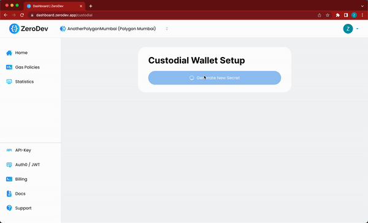

# ZeroDev - Custodial

> **_NOTE:_**  This is only for server environments.

> **_NOTE:_**  Currently, this is in beta and only works on Polygon Mumbai and Goerli.

## Installation
```
npm install @zerodevapp/sdk@alpha @turnkey/ethers 
```

## Setup
1. You will need a `projectID` from [our Dashboard](https://dashboard.zerodev.app).
2. You need to activate the custodial feature [here](https://dashboard.zerodev.app/custodial) which triggers the download of the `custodial.txt` file. 




> **_NOTE:_**  This file contains the private key for managing all the wallets, therefore treat it with utmost caution. We create that file on the frontend, therefore ZeroDev is not aware of it and cannot recover it for you.

## Usage

```typescript
const { ECDSAProvider, getCustodialOwner } = require('@zerodevapp/sdk')

const owner = await getCustodialOwner(
    '<any-kind-of-user-id>', // This can litlerally be anything to identify a wallet
    {
        // The path to the downloaded custodial.txt
        custodialFilePath: 'custodial.txt',
    }
)

// More information about the ECDSAProvider can be found here: 
// https://github.com/zerodevapp/aa-sdk
let ecdsaProvider = await ECDSAProvider.init({
    '<project-id>',
    owner,
    opts: {
        paymasterConfig: {
            policy: "VERIFYING_PAYMASTER"
        }
    }
});
```

## Example
Checkout `index.js`.

You can clone this repository, put the `custodial.txt` in the root and then run:
```
node .
```